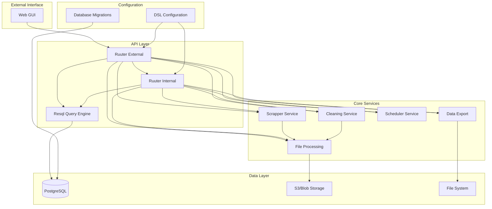
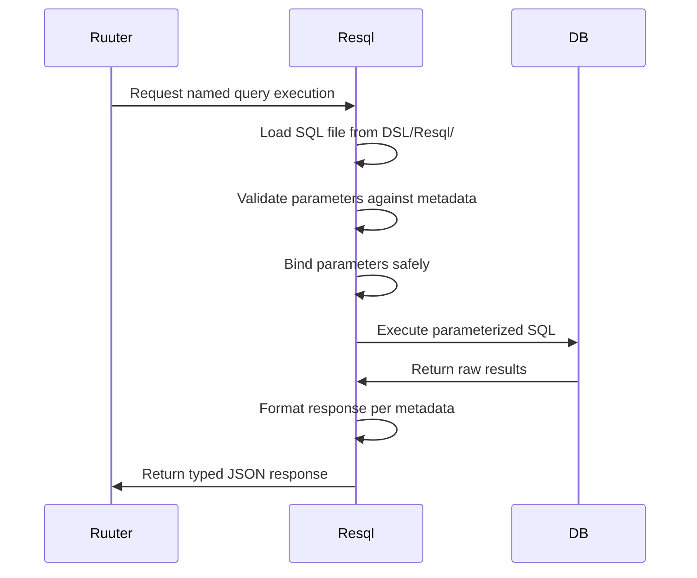
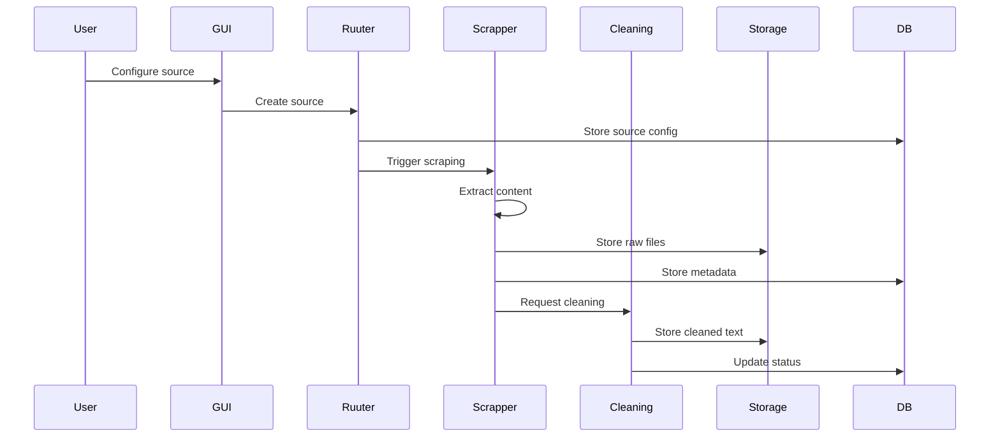
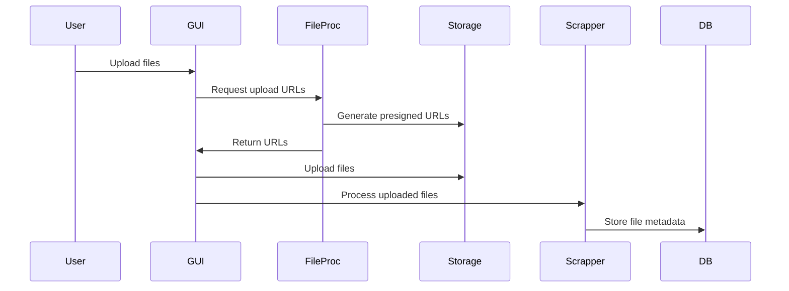

# Common Knowledge Base - System Architecture

## Overview

The Common Knowledge Base (CKB) is a microservices-based data platform designed to collect, process, and manage knowledge from public sector websites and APIs. The system automatically scrapes content, cleans it for LLM consumption, and provides structured access via REST APIs.

## High-Level Architecture

## Service Components

### 1. Web GUI (React/TypeScript)
- **Purpose**: User interface for CKB management
- **Location**: `/GUI/`
- **Technology**: React, TypeScript, Vite
- **Features**: Agency management, source configuration, file uploads, monitoring

### 2. Ruuter External API
- **Purpose**: External-facing REST API with authentication
- **Location**: `/DSL/Ruuter/ckb/`
- **Technology**: Ruuter YAML configurations
- **Features**: JWT authentication, user authorization, secure API access

### 3. Ruuter Internal API  
- **Purpose**: Internal service-to-service communication
- **Location**: `/DSL/Ruuter.internal/ckb/`
- **Technology**: Ruuter YAML configurations
- **Features**: Database operations, pipeline coordination, file management

### 4. Resql Query Engine
- **Purpose**: SQL query execution and database abstraction
- **Location**: `/DSL/Resql/`
- **Technology**: Parameterized SQL with metadata declarations
- **Features**: Type-safe queries, parameter binding, response formatting

### 5. Scrapper Service
- **Purpose**: Web scraping and content collection
- **Location**: `/scrapper/`
- **Technology**: Python, Scrapy, FastAPI, Celery
- **Features**: Multi-source scraping, content extraction, metadata generation

### 6. Cleaning Service
- **Purpose**: Content cleaning and text extraction
- **Location**: `/cleaning/`
- **Technology**: Python, FastAPI, Unstructured, BeautifulSoup
- **Features**: HTML cleaning, document processing, LLM-ready text generation

### 7. File Processing Service
- **Purpose**: File upload, storage, and download management
- **Location**: `/file-processing/`
- **Technology**: Python, FastAPI, S3 integration
- **Features**: Secure file uploads, presigned URLs, blob storage management

### 8. Scheduler Service
- **Purpose**: Cron-based task scheduling and timing
- **Location**: `/scheduler/`
- **Technology**: Python, FastAPI, croniter
- **Features**: Schedule calculation, timezone handling, automated triggers

### 9. Data Export Service
- **Purpose**: Database export and archival
- **Location**: `/data-export/`
- **Technology**: Python, FastAPI, PostgreSQL
- **Features**: CSV export, data compression, automated cleanup

## Data Flow Architecture

### Database Query Flow

### 1. Content Ingestion Pipeline

### 2. File Upload Pipeline

## Database Schema

### Core Tables

1. **agency**: Organization/agency information
2. **source**: Data source configurations
3. **source_file**: Individual file metadata
4. **source_run_page**: Scraping execution logs
5. **source_run_report**: Processing reports

### Key Relationships

- Agency → Sources (1:N)
- Source → Source Files (1:N)
- Source → Run Reports (1:N)
- Run Report → Run Pages (1:N)

## Configuration Management

### DSL (Domain Specific Language)
- **Ruuter Configs**: API endpoint definitions in YAML
- **Resql Queries**: SQL query definitions with metadata declarations
- **DMapper**: Data mapping and transformation templates
- **Export Tasks**: Data export configurations
- **Cron Manager**: Scheduled task definitions

### Resql Integration
- **Query Separation**: SQL logic separated from application code
- **Type Safety**: Parameter and response type validation
- **Security**: Parameterized queries prevent SQL injection
- **Documentation**: Self-documenting queries with metadata
- **Versioning**: Query evolution and compatibility management

### Database Migrations
- **Liquibase**: Version-controlled schema changes
- **Rollback Support**: Safe database updates
- **Test Data**: Development and testing fixtures

## Security Architecture

### Authentication & Authorization
- **JWT Tokens**: Secure user authentication
- **Role-based Access**: Granular permission controls
- **API Security**: Request validation and rate limiting

### Data Security
- **Encrypted Storage**: S3 encryption at rest
- **Secure Transfers**: HTTPS for all communications
- **Input Validation**: SQL injection prevention
- **Access Controls**: Network-level service isolation

## Deployment Architecture

### Containerization
- **Docker**: All services containerized
- **Multi-stage Builds**: Optimized container images
- **Health Checks**: Container health monitoring

### Orchestration
- **Docker Compose**: Local development environment
- **Kubernetes**: Production orchestration (recommended)
- **Service Discovery**: Internal service communication

### Monitoring & Logging
- **Centralized Logging**: Structured log aggregation
- **Health Checks**: Service availability monitoring  
- **Performance Metrics**: Resource usage tracking
- **Error Tracking**: Comprehensive error monitoring

## Development Workflow

### Local Development
1. Clone repository
2. Start services with `docker-compose up`
3. Access GUI at `http://localhost:3000`
4. API available at `http://localhost:8080`

### Testing
- **Unit Tests**: Service-specific test suites
- **Integration Tests**: Cross-service functionality
- **End-to-end Tests**: Complete workflow validation

### Deployment
1. Build Docker images
2. Deploy to container orchestration platform
3. Configure environment variables
4. Run database migrations
5. Start services in dependency order

## Scalability Considerations

### Horizontal Scaling
- **Stateless Services**: All services designed for horizontal scaling
- **Load Balancing**: Multiple instances behind load balancers
- **Database Scaling**: Read replicas and connection pooling

### Performance Optimization
- **Caching**: Redis for session and API response caching
- **Background Processing**: Celery for async task processing
- **Connection Pooling**: Database connection optimization
- **Content Compression**: Gzip compression for large data transfers

## Future Enhancements

### Planned Features
- **Search Integration**: Elasticsearch for full-text search
- **Real-time Updates**: WebSocket support for live updates
- **Advanced Analytics**: Data processing metrics and insights
- **Multi-language Support**: International content processing

### Infrastructure Improvements
- **Service Mesh**: Istio for advanced service communication
- **Observability**: OpenTelemetry for comprehensive monitoring
- **CI/CD Pipeline**: Automated testing and deployment
- **Backup & Recovery**: Automated data backup and disaster recovery