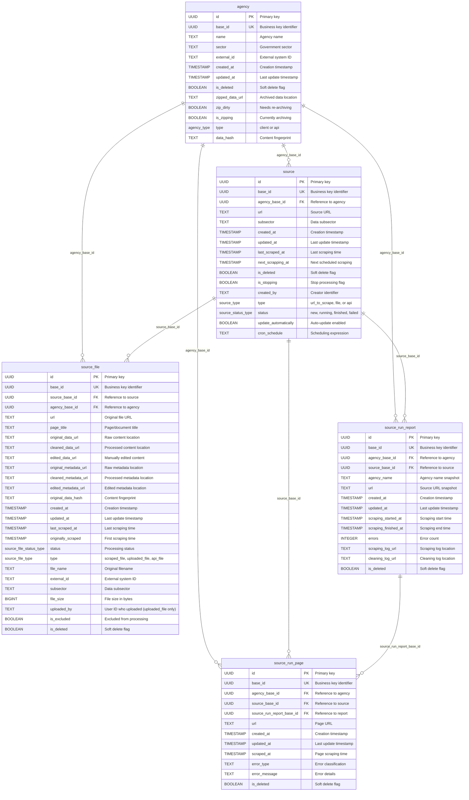
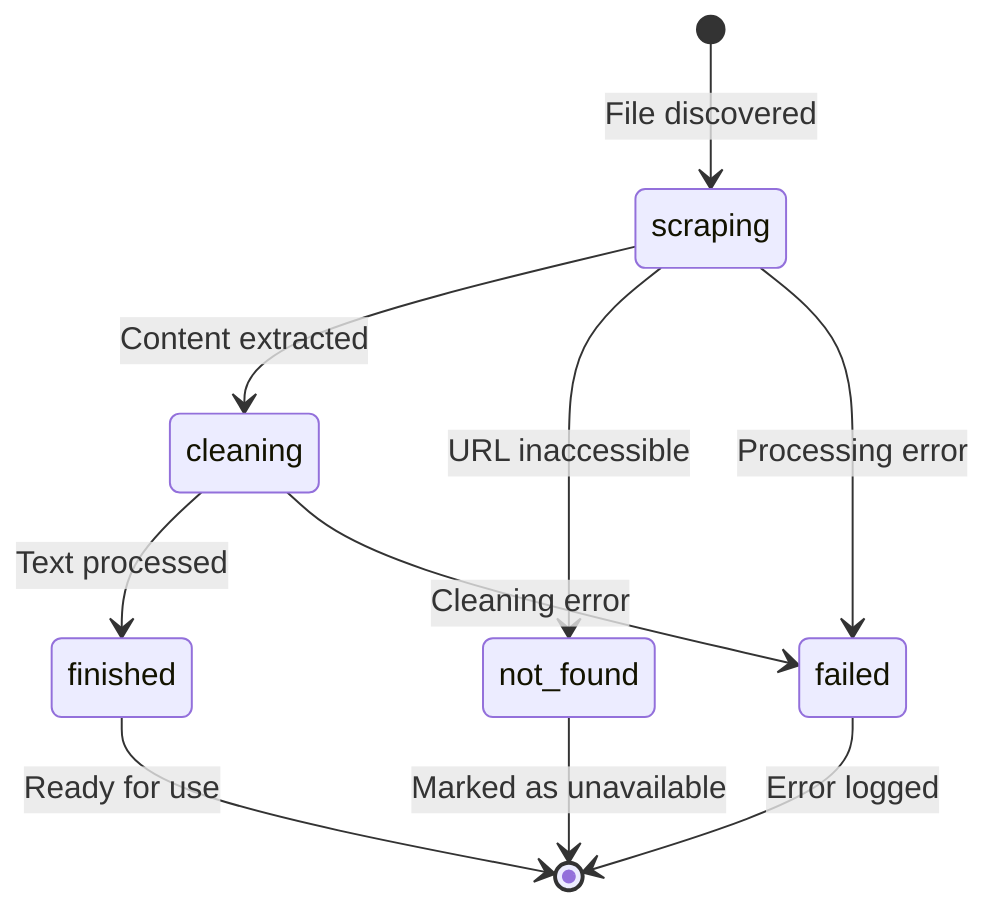
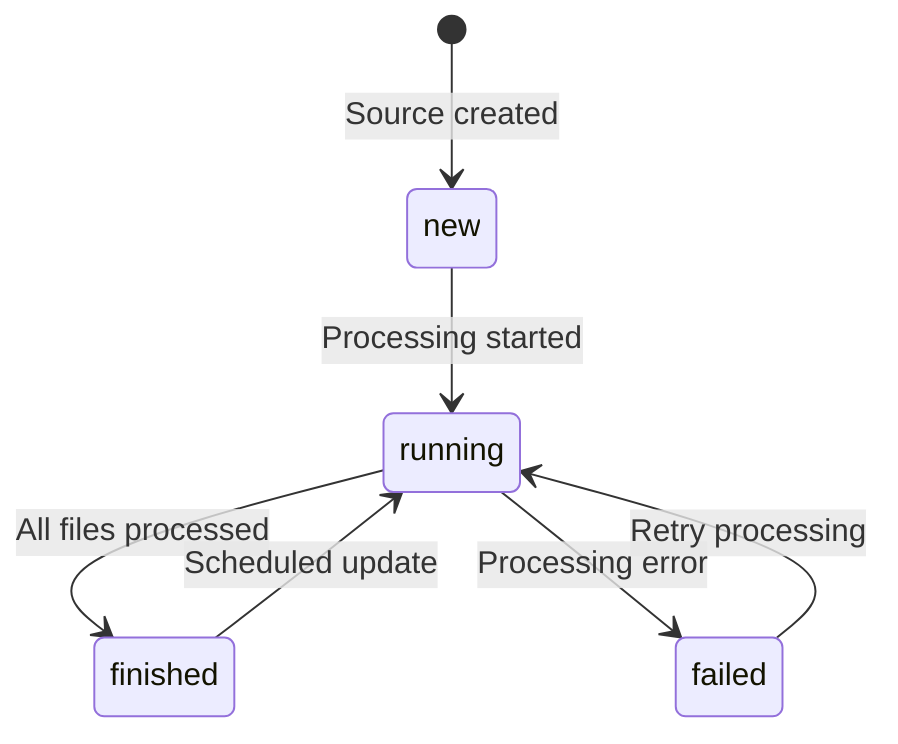

# Database Schema - Entity Relationship Diagram

## Overview

The Common Knowledge Base uses PostgreSQL with a multi-schema design organized by functional areas. The database supports data collection, processing tracking, and monitoring across the ETL pipeline.

## ER Diagram

## Schema Organization

### agency_management
**Purpose**: Manages government agencies and organizational entities
- Contains agency information, metadata, and archival status
- Supports both client agencies and API sources
- Tracks data integrity with hashing and archival status

### data_collection  
**Purpose**: Manages data sources and collected files
- **source**: Configuration for websites, APIs, and upload sources
- **source_file**: Individual files with processing pipeline status
- Tracks ETL pipeline progress from raw to cleaned content

### monitoring
**Purpose**: Tracks processing execution and error logging
- **source_run_report**: High-level processing execution reports
- **source_run_page**: Detailed page-level processing logs
- Provides comprehensive audit trail for all operations

## Key Design Patterns

### UUID-based Identification
- **id**: Technical primary key (UUID)
- **base_id**: Business identifier for external references
- Supports versioning and historical tracking

### Soft Deletion
- **is_deleted**: Logical deletion flag on all tables
- Preserves data for audit and recovery purposes
- Queries filter by `is_deleted = FALSE`

### Timestamp Tracking
- **created_at**: Record creation time
- **updated_at**: Last modification time
- **Processing timestamps**: Track ETL pipeline stages

### Status Enums
- **agency_type**: 'client' | 'api'
- **source_type**: 'url_to_scrape' | 'file' | 'api'
- **source_status_type**: 'new' | 'running' | 'finished' | 'failed'
- **source_file_status_type**: 'scraping' | 'cleaning' | 'finished' | 'not_found' | 'failed'
- **source_file_type**: 'scraped_file' | 'uploaded_file' | 'api_file'

## Relationships

### Primary Relationships
1. **Agency → Source** (1:N): Each agency can have multiple data sources
2. **Source → Source File** (1:N): Each source contains multiple files
3. **Source Run Report → Source Run Page** (1:N): Reports contain page-level logs

### Cross-Schema References
All tables reference `agency_base_id` for data partitioning and access control:
- Enables agency-specific data isolation
- Supports multi-tenant data access patterns
- Facilitates data export and archival by agency

## Data Pipeline Tracking

### File Processing States

### Source Processing States

## Indexes and Performance

### Primary Indexes
- **Composite indexes** on frequently queried column combinations
- **Timestamp indexes** for time-based queries and sorting
- **Status indexes** for filtering by processing state
- **Foreign key indexes** for join performance

### Query Patterns
- **Agency-based filtering**: Most queries filter by `agency_base_id`
- **Status-based queries**: Filter by processing status
- **Time-based queries**: Sort and filter by timestamps
- **Soft delete filtering**: All queries exclude deleted records

## Data Types and Constraints

### UUID Fields
- **id**: Technical primary key
- **base_id**: Business identifier with uniqueness constraints
- **Foreign keys**: Reference base_id fields for logical relationships

### Text Fields
- **Names and titles**: Variable length text
- **URLs**: Full URL storage for source tracking
- **File paths**: Blob storage references
- **Error messages**: Detailed error information

### Timestamp Fields
- **WITH TIME ZONE**: All timestamps include timezone information
- **Default values**: CURRENT_TIMESTAMP for audit fields
- **Nullable timestamps**: Optional for processing-specific times

### Boolean Flags
- **Default FALSE**: Most boolean flags default to false
- **Processing flags**: Track current operation state
- **Configuration flags**: Control automated behavior

## Extensions and Features

### PostgreSQL Extensions
- **uuid-ossp**: UUID generation functions
- **hstore**: Key-value storage support (future use)

### Schema Permissions
- **PUBLIC usage**: All schemas accessible to application users
- **Privilege grants**: Full table access within schemas
- **Public schema restriction**: Prevents accidental public table creation

## Data Integrity

### Referential Integrity
- Foreign key relationships via `base_id` references
- Cascade rules for data consistency
- Constraint validation for enum types

### Data Quality
- **Hash fields**: Content fingerprinting for duplicate detection
- **Timestamp consistency**: Processing pipeline time tracking
- **Status validation**: Enum constraints for valid states

### Audit Trail
- **Comprehensive logging**: All operations logged in monitoring schema
- **Error tracking**: Detailed error capture and classification
- **Processing history**: Complete pipeline execution tracking

## Future Considerations

### Scalability
- **Partitioning**: Consider table partitioning by agency or time
- **Read replicas**: Separate read/write database instances
- **Index optimization**: Monitor and optimize based on query patterns

### Analytics
- **Materialized views**: Pre-computed analytics tables
- **Time-series data**: Enhanced monitoring and metrics
- **Data warehouse**: Separate analytics database for reporting