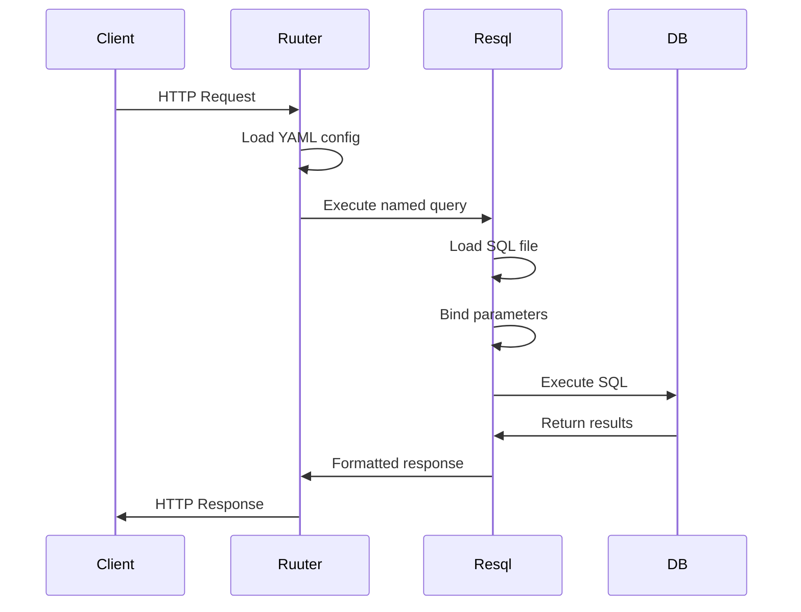

# Resql Query Definitions

This directory contains SQL query definitions that are executed by the Ruuter services. Resql is a system that allows separating SQL logic from application code by defining queries in individual .sql files with metadata declarations.

## Overview

Resql provides:
- **SQL Separation**: Database queries separated from application logic
- **Type Safety**: Parameter and response type definitions
- **Documentation**: Self-documenting queries with metadata
- **Parameterization**: Safe parameter binding to prevent SQL injection
- **Versioning**: Query versioning and evolution support

## Structure

```
DSL/Resql/
├── ckb/                    # Common Knowledge Base queries
│   ├── GET/               # Read operations (SELECT queries)
│   │   ├── agency/        # Agency data retrieval
│   │   ├── reports/       # Report queries
│   │   ├── source/        # Source data queries
│   │   ├── source_file/   # File metadata queries
│   │   └── source_run_page/ # Execution log queries
│   └── POST/              # Write operations (INSERT/UPDATE/DELETE)
│       ├── agency/        # Agency management
│       ├── reports/       # Report operations
│       ├── source/        # Source management
│       ├── source_file/   # File operations
│       └── source_run_page/ # Log management
└── users/                 # User management queries
    ├── GET/
    │   ├── auth_users/    # Authentication queries
    │   └── config/        # Configuration queries
    └── POST/
        └── empty.sql      # Placeholder file
```

## Query Format

Each .sql file contains a query with metadata declaration:

```sql
/*
declaration:
  version: 0.1
  description: "Brief description of what this query does"
  method: get|post
  namespace: entity_name
  accepts: json          # For POST queries
  returns: json
  allowlist:
    query:               # For GET parameters
      - field: field_name
        type: string|integer|uuid
        description: "Field description"
    body:                # For POST body parameters
      - field: field_name
        type: string
        description: "Field description"
  response:
    fields:
      - field: response_field
        type: string|integer|timestamp
        description: "Response field description"
*/

-- SQL query follows the declaration
SELECT column1, column2 
FROM table_name 
WHERE condition = :parameter_name::TYPE;
```

## Key Query Categories

### Agency Management

**GET Operations:**
- `get_agency.sql` - Retrieve agency by base ID
- `list_agencies.sql` - List all agencies
- `get_dirty_agency.sql` - Get agencies needing data refresh
- `list_agency_data_hash.sql` - Get agency data hashes for change detection

**POST Operations:**
- `create_agency.sql` - Create new agency
- `update_agency.sql` - Update agency information
- `delete_agency.sql` - Soft delete agency
- `update_agency_zip_and_data_hash.sql` - Update archive status

### Source Management

**GET Operations:**
- `get_source.sql` - Retrieve source configuration
- `list_agency_sources.sql` - List sources for an agency
- `list_api_sources.sql` - List API-based sources
- `get_source_not_scheduled.sql` - Find sources needing scheduling

**POST Operations:**
- `create_source.sql` - Create new data source
- `update_source_status.sql` - Update processing status
- `update_source_scrape_interval.sql` - Modify scraping frequency
- `update_source_is_running.sql` - Set running state

### Source File Management

**GET Operations:**
- `list_scraped_source_files.sql` - List scraped files
- `list_uploaded_source_files.sql` - List uploaded files
- `get_source_file.sql` - Get file metadata
- `list_excluded_source_files_by_agency.sql` - List excluded files

**POST Operations:**
- `create_scraped_source_file.sql` - Add scraped file record
- `create_uploaded_source_files.sql` - Add uploaded file records
- `update_source_file_cleaned.sql` - Update after cleaning
- `update_source_file_scraped.sql` - Update scraping status
- `delete_source_file.sql` - Remove file record

### Reports and Monitoring

**GET Operations:**
- `list_source_run_reports.sql` - List processing reports
- `get_source_report_logs.sql` - Get detailed logs
- `list_source_run_pages.sql` - List page-level logs

**POST Operations:**
- `create_source_run_report.sql` - Create processing report
- `update_source_run_report.sql` - Update report status
- `create_source_run_page.sql` - Log page processing
- `delete_source_run_pages.sql` - Clean up old logs

### User Management

**GET Operations:**
- `get_user_by_login.sql` - Authenticate user by login
- `get_user_is_allowed_by_user_role.sql` - Check user permissions
- `get_configuration.sql` - Get system configuration

## Parameter Binding

Resql uses safe parameter binding to prevent SQL injection:

### Parameter Types
- `:param_name::STRING` - String values
- `:param_name::UUID` - UUID values  
- `:param_name::INTEGER` - Integer values
- `:param_name::TIMESTAMP` - Timestamp values
- `:param_name::BOOLEAN` - Boolean values

### Example Usage
```sql
-- Safe parameter binding
SELECT * FROM agency 
WHERE base_id = :agency_id::UUID 
  AND name ILIKE :search_term::STRING;

-- Array parameters
SELECT * FROM source_file 
WHERE id = ANY(:file_ids::UUID[]);
```

## Database Schema Integration

### Core Tables

1. **agency_management.agency**
   - `id`: Primary key
   - `base_id`: UUID identifier
   - `name`: Agency name
   - `sector`: Government sector
   - `external_id`: External system identifier
   - `is_deleted`: Soft delete flag
   - `created_at`, `updated_at`: Timestamps

2. **source_management.source**
   - `id`: Primary key
   - `base_id`: UUID identifier
   - `agency_id`: Foreign key to agency
   - `name`: Source name
   - `url`: Source URL
   - `scrape_interval`: Update frequency
   - `is_running`: Processing status
   - `next_run_timestamp`: Next scheduled run

3. **file_management.source_file**
   - `id`: Primary key
   - `base_id`: UUID identifier
   - `source_id`: Foreign key to source
   - `file_name`: Original file name
   - `content_hash`: Content fingerprint
   - `status`: Processing status
   - `original_data_url`: Raw content location
   - `cleaned_data_url`: Processed content location

## Integration with Ruuter

### Query Execution Flow



### Query Naming Convention

Queries are named to match their Ruuter endpoints:
- `GET /agency/get` → `DSL/Resql/ckb/GET/agency/get_agency.sql`
- `POST /source/add` → `DSL/Resql/ckb/POST/source/create_source.sql`
- `GET /source-file/all` → `DSL/Resql/ckb/GET/source_file/list_source_files.sql`

## Query Development

### Best Practices

1. **Documentation**: Include comprehensive metadata declarations
2. **Performance**: Use appropriate indexes and query optimization
3. **Security**: Always use parameterized queries
4. **Consistency**: Follow naming conventions and response formats
5. **Testing**: Test queries with sample data

### Adding New Queries

1. **Create SQL File**
   ```bash
   touch DSL/Resql/ckb/GET/entity/new_query.sql
   ```

2. **Add Metadata Declaration**
   ```sql
   /*
   declaration:
     version: 0.1
     description: "Query description"
     method: get
     namespace: entity
     returns: json
     allowlist:
       query:
         - field: param_name
           type: string
           description: "Parameter description"
   */
   ```

3. **Write SQL Query**
   ```sql
   SELECT column1, column2
   FROM table_name
   WHERE condition = :param_name::STRING;
   ```

4. **Create Ruuter Endpoint**
   ```yaml
   # DSL/Ruuter/ckb/GET/entity/new-endpoint.yml
   DSL:
     - name: execute_query
       resql:
         query: new_query
   ```

## Query Categories by Purpose

### Data Retrieval (GET)
- **Listing**: `list_*` queries for data browsing
- **Details**: `get_*` queries for specific records
- **Status**: Queries for processing status and health
- **Search**: Filtered and paginated data access

### Data Modification (POST)
- **Creation**: `create_*` queries for new records
- **Updates**: `update_*` queries for record modification
- **Deletion**: `delete_*` queries for record removal
- **Status Changes**: Workflow state transitions

## Performance Considerations

### Query Optimization
- **Indexes**: Ensure proper database indexes
- **Joins**: Optimize join operations
- **Pagination**: Use LIMIT and OFFSET appropriately
- **Aggregation**: Efficient GROUP BY and aggregation queries

### Caching Strategy
- **Result Caching**: Cache frequently accessed data
- **Parameter Caching**: Cache parameterized query plans
- **Connection Pooling**: Reuse database connections

## Error Handling

### Common Error Types
- **Parameter Validation**: Invalid or missing parameters
- **Constraint Violations**: Database constraint errors
- **Permission Errors**: Access control violations
- **Performance Issues**: Query timeout and resource limits

### Error Response Format
```json
{
  "error": "Error message",
  "code": "ERROR_CODE",
  "details": "Detailed error information"
}
```

## Testing

### Query Testing
```bash
# Test individual queries
psql -d ckb -f DSL/Resql/ckb/GET/agency/get_agency.sql

# Test with parameters
psql -d ckb -v base_id="'uuid-value'" -f query.sql
```

### Integration Testing
- Test queries through Ruuter endpoints
- Validate parameter binding and response format
- Check error handling and edge cases

## Monitoring

### Query Performance
- **Execution Time**: Monitor slow queries
- **Resource Usage**: Track memory and CPU usage
- **Connection Counts**: Monitor database connections
- **Error Rates**: Track failed query executions

### Maintenance
- **Query Analysis**: Regular performance review
- **Index Optimization**: Maintain optimal indexes
- **Schema Evolution**: Handle database schema changes
- **Documentation Updates**: Keep metadata current