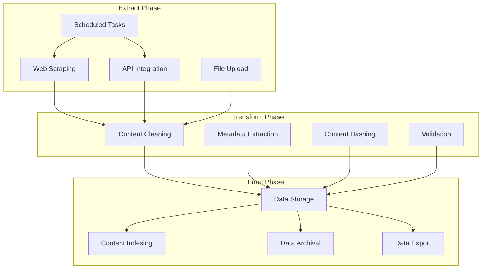
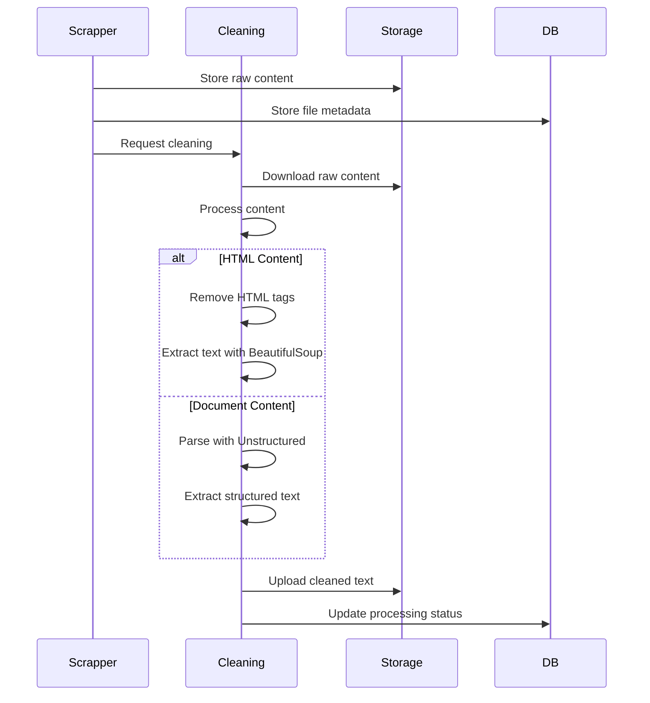
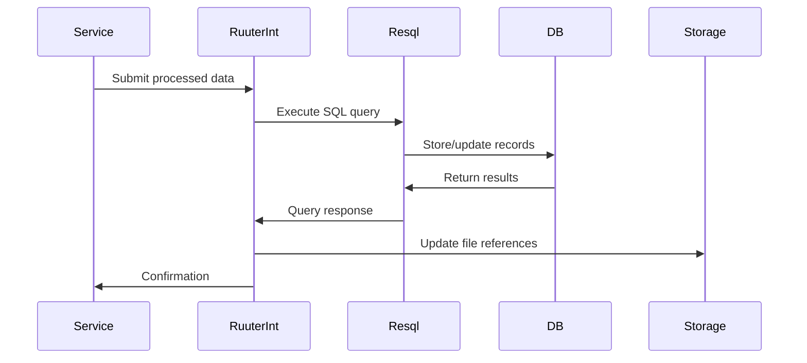

# ETL Processes and Data Flows

## Overview

The Common Knowledge Base implements a comprehensive ETL (Extract, Transform, Load) pipeline that automatically collects, processes, and manages data from various sources. The system is designed to maintain up-to-date knowledge for large language model consumption.

## ETL Pipeline Architecture



## Data Sources

### 1. Web Scraping Sources
- **Estonian Government Sites**: Specialized scraper for public sector content
- **General Websites**: Configurable scraping for any website
- **Sitemap-based**: Automatic URL discovery via sitemaps
- **Specific Pages**: Targeted scraping of defined URLs

### 2. API Sources
- **REST APIs**: Direct integration with data APIs
- **File APIs**: Processing files from API endpoints
- **Real-time Feeds**: Periodic polling of data feeds

### 3. Manual Uploads
- **Document Upload**: PDF, DOCX, DOC processing
- **Bulk Upload**: Multiple file processing
- **Metadata Enrichment**: Manual metadata addition

## Extract Phase

### Web Scraping Process

1. **Source Configuration**
   - Define target URLs and scraping parameters
   - Set scraping intervals and scheduling
   - Configure content type expectations

2. **Content Extraction**
   - Use Playwright for JavaScript-heavy sites
   - Handle multiple content types (HTML, PDF, documents)
   - Extract text, images, and metadata
   - Generate content hashes for duplicate detection

3. **Error Handling**
   - Log failed requests and network errors
   - Implement retry mechanisms
   - Track source availability and status

### API Integration Process

1. **API Configuration**
   - Define API endpoints and authentication
   - Set polling intervals and data formats
   - Configure response parsing rules

2. **Data Retrieval**
   - Execute scheduled API calls
   - Parse JSON/XML responses
   - Handle pagination and rate limiting
   - Process file downloads from APIs

### File Upload Process

1. **Upload Management**
   - Generate presigned URLs for secure uploads
   - Validate file types and sizes
   - Track upload progress and status

2. **File Processing**
   - Convert uploads to scraping tasks
   - Extract content using appropriate parsers
   - Generate metadata for uploaded files

## Transform Phase

### Content Cleaning Pipeline



### Content Transformation Steps

1. **HTML Processing**
   - Remove HTML tags and CSS styles
   - Extract readable text content
   - Preserve document structure where relevant
   - Handle special characters and encoding

2. **Document Processing**
   - Parse PDF, DOCX, DOC files
   - Extract text while preserving formatting
   - Handle embedded images and tables
   - Support multiple languages

3. **Metadata Generation**
   - Extract page titles and descriptions
   - Generate content fingerprints
   - Record processing timestamps
   - Track content source and lineage

4. **Content Validation**
   - Verify content integrity
   - Check for duplicate content
   - Validate extracted text quality
   - Flag problematic content

## Load Phase

### Data Storage Pipeline



### Storage Mechanisms

1. **Database Storage (PostgreSQL)**
   - **Structured Data**: Agency, source, and file metadata
   - **Processing Status**: Track ETL pipeline progress
   - **Relationships**: Maintain data lineage and dependencies
   - **Indexing**: Optimize for query performance

2. **Blob Storage (S3)**
   - **Raw Content**: Original scraped files
   - **Cleaned Content**: Processed text files
   - **Metadata**: JSON metadata files
   - **Archives**: Compressed historical data

3. **File System**
   - **Temporary Files**: Processing intermediates
   - **Logs**: Service execution logs
   - **Exports**: Generated data exports
   - **Configuration**: DSL and settings files

### Data Archival

1. **Export Process**
   - **Scheduled Exports**: Daily/weekly data exports
   - **Compression**: Gzip compression for efficiency
   - **Timestamping**: Versioned export files
   - **Cleanup**: Remove exported data from active tables

2. **Archive Management**
   - **Cold Storage**: Move old data to cheaper storage
   - **Retention Policies**: Automated data lifecycle management
   - **Backup Strategy**: Regular backup scheduling

## Scheduling and Automation

### Cron-based Scheduling

The system uses multiple scheduled tasks for automation:

```yaml
# Every 5 minutes: Check for unscheduled sources
trigger_scheduler: "0 */5 * * * ?"

# Every 5 minutes: Execute scheduled scraping
trigger_pipeline: "0 */5 * * * ?"

# Hourly: Archive and compress data
trigger_zipping: "0 0 */1 * * ?"
```

### Pipeline Coordination

1. **Source Scheduling**
   - Identify sources due for updates
   - Calculate next run times based on intervals
   - Queue scraping tasks

2. **Task Execution**
   - Distribute scraping tasks across workers
   - Monitor task progress and status
   - Handle failures and retries

3. **Data Processing**
   - Trigger cleaning after successful scraping
   - Update metadata and status
   - Generate notifications for completion

## Data Quality Management

### Content Validation

1. **Duplicate Detection**
   - SHA1 hashing for content fingerprinting
   - Cross-source duplicate identification
   - Prevent redundant processing

2. **Quality Metrics**
   - Content length and structure validation
   - Language detection and processing
   - Encoding and character set handling

3. **Error Tracking**
   - Comprehensive error logging
   - Failed operation tracking
   - Recovery and retry mechanisms

### Monitoring and Alerts

1. **Pipeline Health**
   - Service availability monitoring
   - Queue depth and processing times
   - Error rate tracking

2. **Data Quality Metrics**
   - Content freshness indicators
   - Processing success rates
   - Storage utilization metrics

## Performance Optimization

### Scalability Features

1. **Horizontal Scaling**
   - Stateless service design
   - Load-balanced deployments
   - Worker pool management

2. **Caching Strategy**
   - Content deduplication
   - Metadata caching
   - Query result caching

3. **Resource Management**
   - Connection pooling
   - Memory optimization
   - Disk space management

### Processing Efficiency

1. **Parallel Processing**
   - Concurrent scraping tasks
   - Multi-threaded cleaning
   - Batch operations

2. **Smart Scheduling**
   - Content change detection
   - Adaptive polling intervals
   - Priority-based processing

## Configuration and Maintenance

### System Configuration

1. **Environment Variables**
   - Service endpoints and credentials
   - Storage configuration
   - Processing parameters

2. **DSL Configuration**
   - API endpoint definitions
   - Database query specifications
   - Pipeline workflow definitions

### Maintenance Operations

1. **Database Maintenance**
   - Index optimization
   - Statistics updates
   - Cleanup operations

2. **Storage Management**
   - Archive old content
   - Clean temporary files
   - Monitor storage usage

3. **Service Health**
   - Regular health checks
   - Performance monitoring
   - Capacity planning

## Troubleshooting

### Common Issues

1. **Scraping Failures**
   - Network connectivity issues
   - Website structure changes
   - Authentication problems

2. **Processing Errors**
   - File format compatibility
   - Encoding issues
   - Resource limitations

3. **Storage Issues**
   - Disk space constraints
   - Network storage problems
   - Permission issues

### Debugging Tools

1. **Logs Analysis**
   - Service-specific log files
   - Error tracking and correlation
   - Performance metrics

2. **Database Queries**
   - Direct database inspection
   - Query performance analysis
   - Data integrity checks

3. **Service Testing**
   - Health check endpoints
   - Manual task triggering
   - Integration testing tools